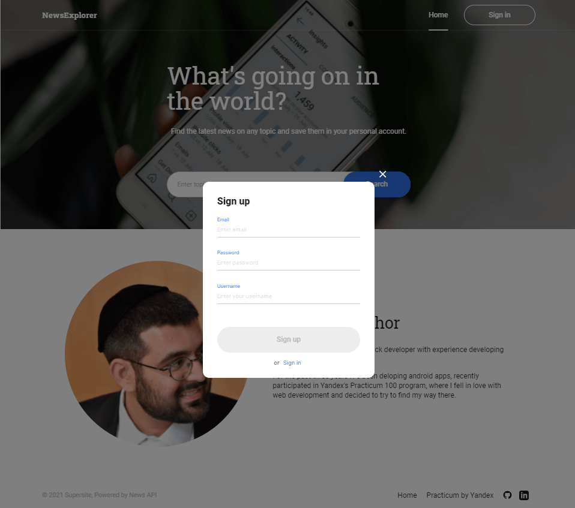
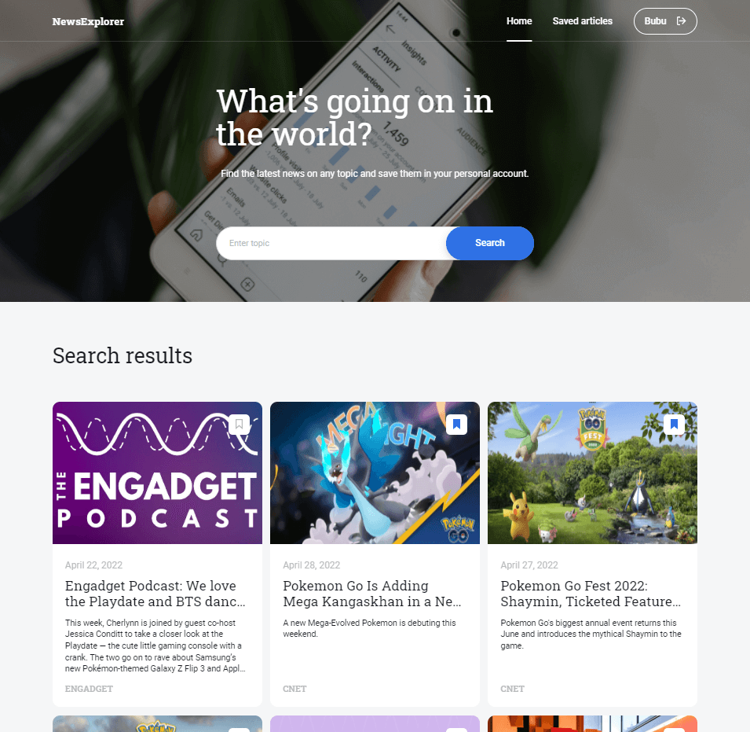
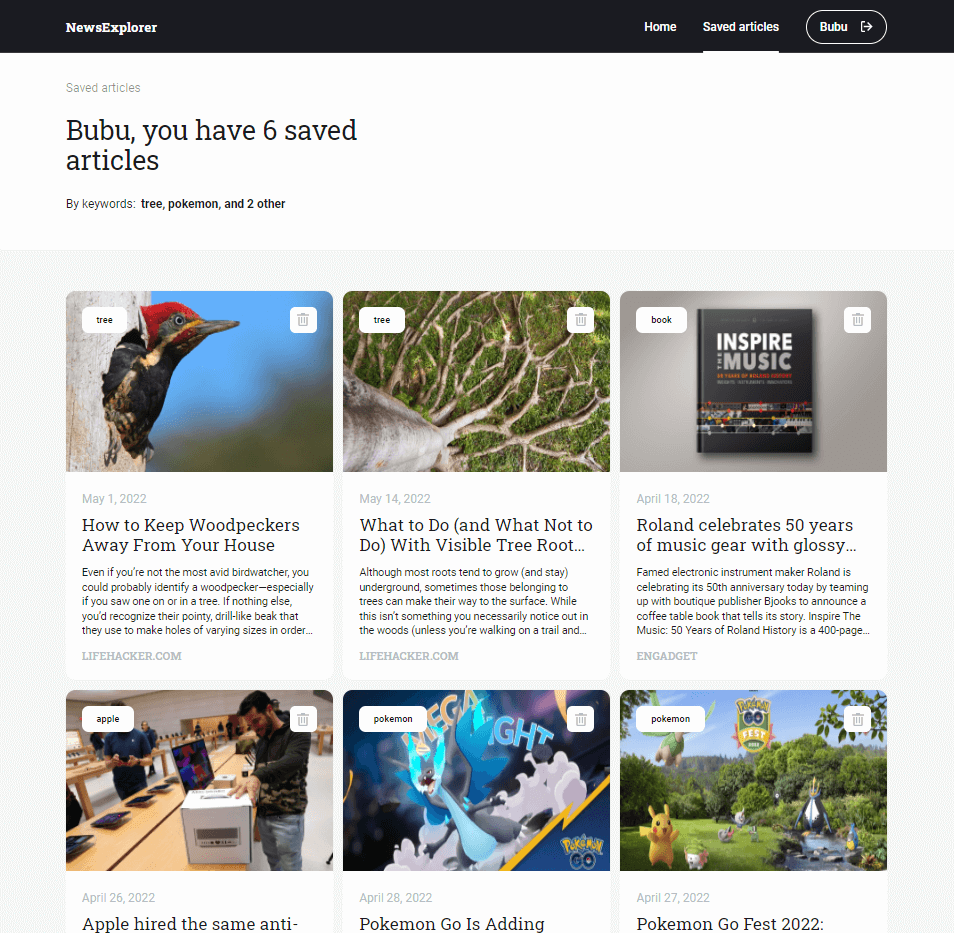

# News Explorer

## This repository contains:

- The **[frontend](https://alfons-news-app.students.nomoreparties.sbs)** React Application
- **[Backend API](https://api.alfons-news-app.students.nomoreparties.sbs)**

## Project overview

- Registration and login users
- Search news from all over the world pertaining to a specific topic
- Save articles to your reading list
- Enter your reading list on your account to view saved articles

## In this project I've specialized in:

- Node.js
- Express.js
- MongoDB
- React
- Adaptive design
- Fetch requests
- Google cloud
- News API

## Screenshots

#### Sign up

#### Search news

#### Reading list

